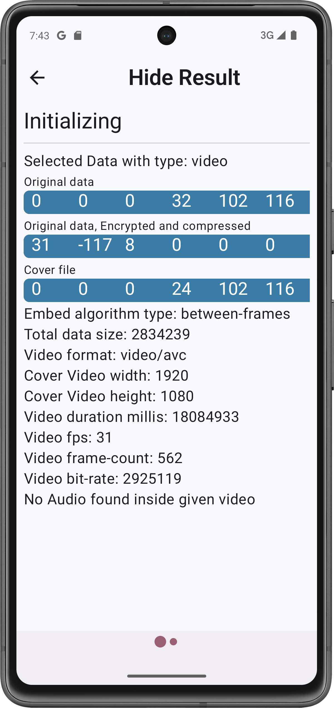

# shadestream

**Secure Video Steganography Chat App (Android, Kotlin)**

shadestream is an Android application that embeds hidden payloads into MP4 video streams and provides an end-to-end encrypted chat interface for exchanging stego-videos.  

---

## ✨ Features
- Android app (Kotlin, Android Studio project)
- Encodes text/messages into MP4 video frames
- Decodes stego-videos on device
- Secure chat interface for exchanging stego media
- Modern Android UI (Jetpack Compose)

---
## 🖼 Screenshots

Here are some screenshots showcasing key features of the app:

### Auth & Profile

  
  
  

---
## Chat & Status

  
  
  
  
  

---

## Stegnography

  
  
  
  
  
  
  
  

---

## Example Steganography

https://github.com/user-attachments/assets/5c8885fe-125f-4d0d-8673-c052d45c9952

